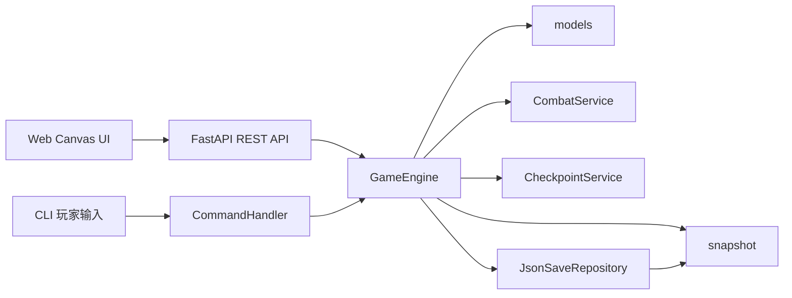
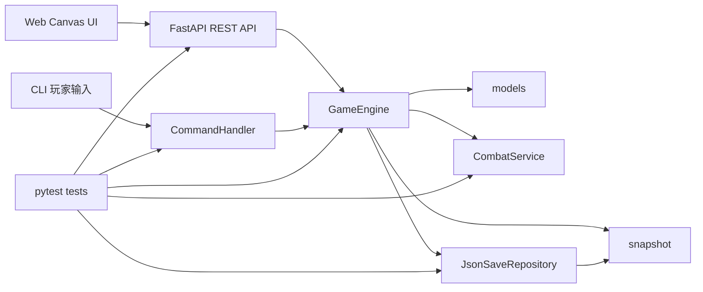

# MUD 洞穴探险游戏

一个从控制台演进到 Web 图形界面的文字冒险游戏。玩家在洞穴中探索、拾取物品、进行回合制战斗，最终挑战远古巨龙。

## 游戏故事

你是一名勇敢的冒险者，听说这个洞穴深处有一条远古巨龙，它守护着无数的财宝。你决定进入洞穴，击败巨龙，成为传奇。

## 本地开发环境搭建

### 1. 准备工作
- **Python 版本**: 推荐使用 Python 3.10 或更高版本。
- **虚拟环境 (推荐)**: 建议在项目根目录下创建并激活虚拟环境，以隔离依赖。
  ```powershell
  # Windows
  python -m venv .venv
  .\.venv\Scripts\activate
  ```

### 2. 安装依赖
```powershell
pip install -r requirements.txt
```

### 3. 运行游戏
```powershell
python game/main.py
```

### 4. 运行 Web 图形界面
```powershell
uvicorn game.api:app --reload
```

浏览器访问 `http://127.0.0.1:8000`。前端位于 `web/`，通过 RESTful API 调用后端业务逻辑。

### 5. 运行单元测试与 API 集成测试
项目使用 `pytest` 进行回归保护，运行以下命令执行全量测试：
```powershell
python -m pytest
```

### 6. 构建 Docker 镜像
```powershell
docker build -t mud-cave-web .
docker run --rm -p 8000:8000 mud-cave-web
```

## 系统架构图（模块关系）



### 1. 推荐环境

- Python 3.10+（CI 当前覆盖 3.10 / 3.11 / 3.12）
- Linux / macOS / Windows（WSL）

### 2. 克隆与进入目录

```bash
git clone <your-repo-url>
cd ai-and-us
```

### 3. 创建虚拟环境并安装依赖

Linux / macOS:

```bash
python -m venv .venv
source .venv/bin/activate
pip install --upgrade pip
pip install -r requirements.txt
```

Windows PowerShell:

```powershell
python -m venv .venv
.venv\Scripts\Activate.ps1
python -m pip install --upgrade pip
pip install -r requirements.txt
```

### 4. 运行游戏

```bash
python game/main.py
```

### 5. 运行测试

```bash
pytest tests/ -v --tb=short
```

说明：`pytest.ini` 已配置 `pythonpath = .` 与 `testpaths = tests`，可直接在仓库根目录执行。`tests/test_api_integration.py` 覆盖 Web 前端依赖的 REST API 核心链路。

### 6. 运行 Web 与容器

```bash
uvicorn game.api:app --reload
docker build -t mud-cave-web .
docker run --rm -p 8000:8000 mud-cave-web
```

## 系统架构图（模块关系）



## 核心业务模块职责

| 模块 | 主要职责 | 关键文件 |
|------|----------|----------|
| 命令适配层 | 解析输入命令，分派到引擎接口 | `game/commands.py` |
| 引擎编排层 | 管理房间、玩家、检查点、存读档、战斗入口 | `game/engine.py` |
| 领域模型层 | 定义 Player/Room/Enemy/Item 等核心实体与规则 | `game/models.py` |
| 战斗服务层 | 负责攻击、反击、升级、BOSS 胜利结算 | `game/services/combat_service.py` |
| 检查点服务层 | 负责检查点更新、死亡记录与复活流程 | `game/services/checkpoint_service.py` |
| 持久化层 | 将快照保存为 JSON 并读取恢复 | `game/infrastructure/json_save_repository.py` |
| 快照层 | 运行时对象与序列化结构之间的转换 | `game/snapshot.py` |
| REST API 层 | 提供 Web 前端与后端业务逻辑的联调接口 | `game/api.py` |
| Web 表现层 | 使用 Canvas 绘制地图并调用 REST API | `web/` |
| 默认世界组装层 | 创建默认洞穴世界，供 CLI 与 API 复用 | `game/world.py` |
| 启动组装层 | 创建默认世界并启动命令循环 | `game/main.py` |

## REST API 快速说明

| 方法 | 路径 | 说明 |
|------|------|------|
| `POST` | `/session` | 创建新游戏会话 |
| `GET` | `/session/{session_id}` | 获取当前会话状态 |
| `POST` | `/session/{session_id}/move` | 按方向移动 |
| `POST` | `/session/{session_id}/look` | 搜索当前房间 |
| `POST` | `/session/{session_id}/inventory/take` | 拾取物品 |
| `POST` | `/session/{session_id}/inventory/use` | 使用物品 |
| `POST` | `/session/{session_id}/attack` | 攻击当前敌人 |
| `POST` | `/session/{session_id}/respawn` | 死亡后复活 |
| `POST` | `/session/{session_id}/command` | 兼容原命令解析器 |

## 游戏目标

1. 探索洞穴的 7 个房间。
2. 收集武器和药水提升实力。
3. 击败沿途怪物并积累经验升级。
4. 最终击败远古巨龙。

## 地图流程

```text
洞穴入口 -> 阴暗走廊 -> 哥布林营地 -> 宝藏室 -> 兽人大厅 -> 武器库 -> BOSS 巢穴
```

## 常用命令

| 分类 | 命令 | 说明 |
|------|------|------|
| 移动 | `go north` / `n` | 向北移动 |
| 移动 | `go south` / `s` | 向南移动 |
| 移动 | `go east` / `e` | 向东移动 |
| 移动 | `go west` / `w` | 向西移动 |
| 探索 | `look` / `l` | 搜索房间，发现物品 |
| 状态 | `stats` / `hp` | 查看角色状态 |
| 物品 | `take <物品>` | 拾取物品（支持紧凑输入） |
| 物品 | `inventory` / `i` | 查看背包 |
| 物品 | `use <药水>` | 使用药水恢复生命 |
| 战斗 | `attack` | 攻击当前房间敌人 |
| 生存 | `respawn` | 死亡后在检查点复活 |
| 存档 | `save [文件名]` | 保存游戏 |
| 读档 | `load [文件名]` | 加载游戏 |
| 系统 | `help` | 查看帮助 |
| 系统 | `quit` | 退出游戏 |

## 测试与 CI

- 单元测试目录：`tests/`
- API 集成测试：`tests/test_api_integration.py`
- 本地执行：`pytest tests/ -v --tb=short`
- CI 文件：`.github/workflows/ci.yml`

CI 在以下场景自动执行测试：

- push 到任意分支
- pull request 到 `main`、`develop`

并在 Python 3.10 / 3.11 / 3.12 三个版本矩阵下运行。CI 还会执行 Docker 镜像构建；非 PR 触发时会将镜像推送到 GHCR，镜像名由 `ghcr.io/<owner>/<repo>` 和提交 SHA 自动生成。

## 项目结构

```text
ai-and-us/
├── game/
│   ├── main.py
│   ├── commands.py
│   ├── engine.py
│   ├── models.py
│   ├── snapshot.py
│   ├── api.py
│   ├── world.py
│   ├── services/
│   │   ├── combat_service.py
│   │   └── checkpoint_service.py
│   └── infrastructure/
│       └── json_save_repository.py
├── tests/
│   ├── test_api_integration.py
│   ├── test_checkpoint_service.py
│   ├── test_engine.py
│   ├── test_combat_service.py
│   ├── test_json_save_repository.py
│   └── test_snapshot.py
├── .github/workflows/ci.yml
├── Dockerfile
├── web/
│   ├── index.html
│   ├── styles.css
│   └── app.js
├── pytest.ini
├── requirements.txt
└── README.md
```
