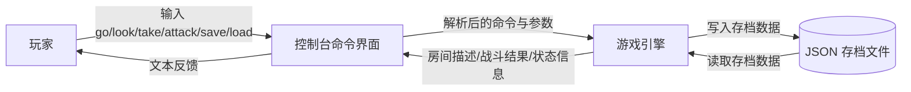
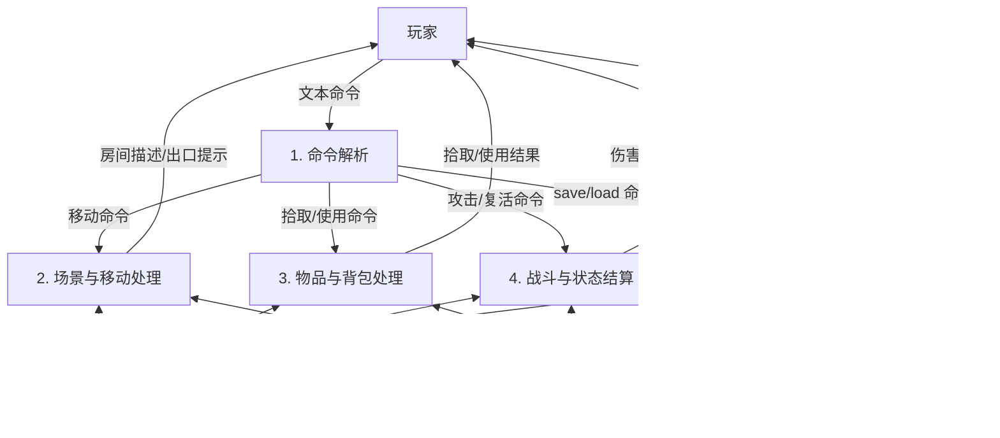
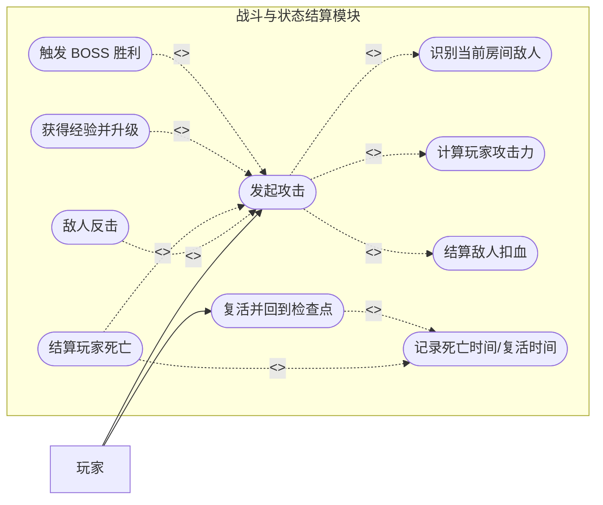
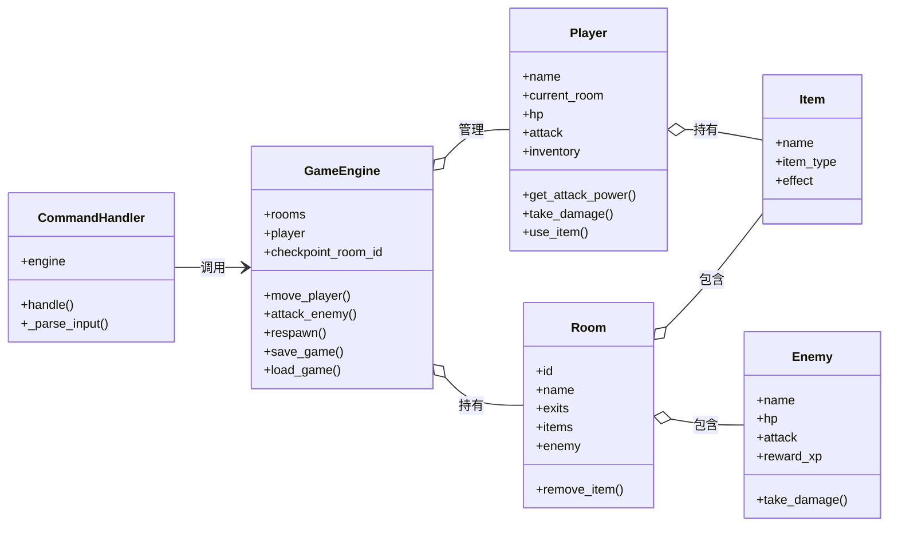
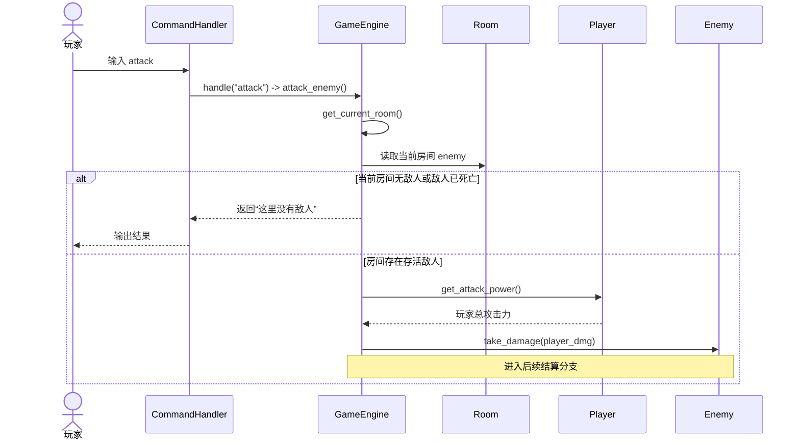
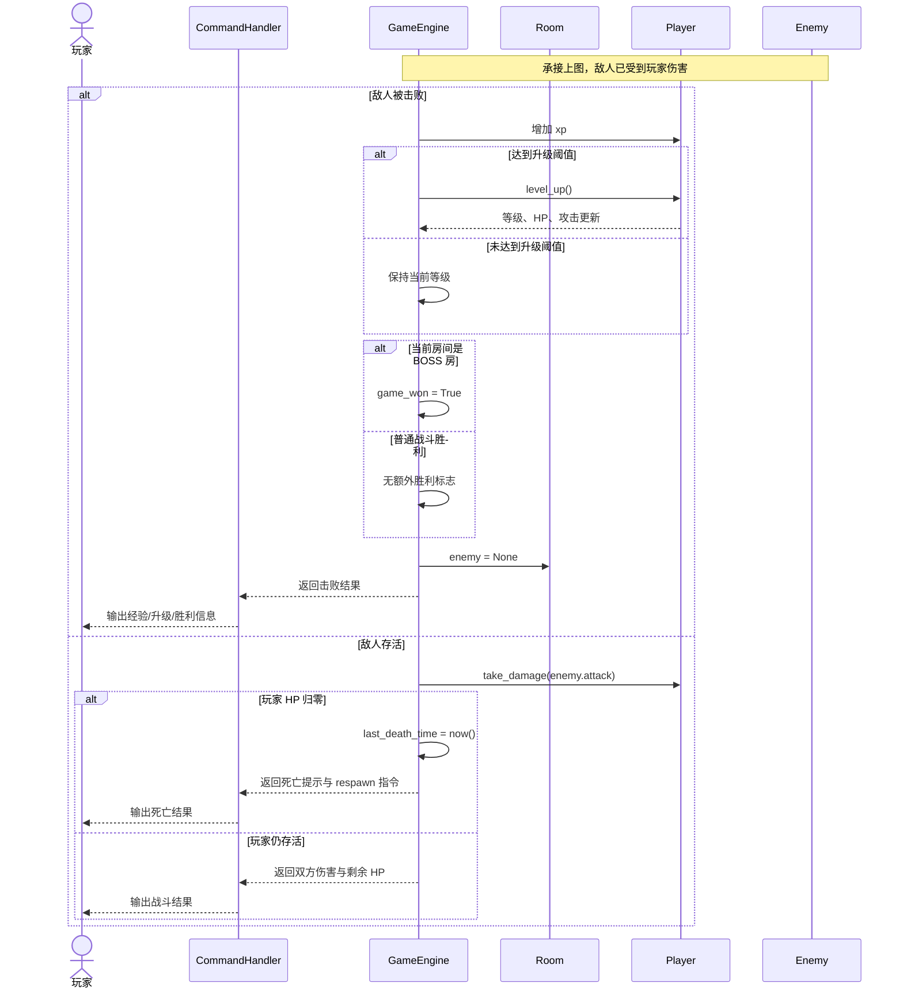

# Sprint 2 启动：MUD 架构解耦与重构规划

## 1. 文档说明

- 项目名称：`ai-and-us` 控制台 MUD 洞穴探险游戏
- 分析对象：Sprint 1 已跑通的单机 MUD 核心世界
- 本次聚焦模块：战斗与状态结算模块
- 分析依据：
  - 代码入口：`game/main.py`
  - 核心引擎：`game/engine.py`
  - 数据模型：`game/models.py`
  - 命令解析：`game/commands.py`
  - 测试样例：`tests/test_engine.py`
- 建模方法：OOA 逆向分析 + 结构化 DFD + 面向对象重构规划

> 说明：团队成员姓名、学号可在提交前替换第 2 节中的占位信息。

---

## 2. Sprint 2 团队分工

| 成员 | 负责内容 | 本周 OOA 建模职责 | Sprint 2 重构落地职责 |
|------|----------|------------------|----------------------|
| 成员 王鹏 | 组长 / 架构统筹 | 汇总类图、顺序图、重构边界 | 负责 `GameEngine` 拆分与服务层落地 |
| 成员 曹睿杰 | 业务分析 | 产出用例图、整理 Include / Extend | 负责战斗模块与状态结算重构 |
| 成员 张津毓 | 数据建模 / 测试验收 | 产出 DFD、梳理状态流与存档流，并复核 AI 逆向模型正确性 | 负责存档仓储层、房间状态恢复、测试补全与回归验证 |

建议协作方式：

- 成员 王鹏 先划清重构边界，避免多人同时修改同一文件。
- 成员 曹睿杰 完成战斗子系统与存档子系统设计，减少等待时间。
- 成员 张津毓 在建模完成后立即补测试，优先覆盖攻击分支、复活分支、读档恢复分支。

---

## 3. 系统数据流图（DFD）

### 3.1 上下文级 DFD



### 3.2 0 层 DFD



### 3.3 DFD 解读

- 外部实体只有玩家，说明当前系统仍是单机单用户闭环。
- `GameEngine` 同时承担了处理过程 `P2/P3/P4/P5`，这已经暴露出“流程过于集中”的问题。
- 数据存储虽然逻辑上可拆分为玩家状态、房间状态、检查点、存档文件，但代码层面多数仍堆在同一个引擎对象中。

---

## 4. 核心用例图（Use Case）

### 4.1 模块边界说明

本次选择“战斗与状态结算模块”作为负责模块。原因如下：

- 该模块横跨命令解析、房间敌人识别、玩家攻击、敌人反击、升级、死亡复活、BOSS 胜利等多个核心流程。
- 它最能体现当前代码中 `GameEngine` 的职责膨胀问题。
- 该模块也最适合在 Sprint 2 中应用封装、继承、多态来做彻底解耦。

### 4.2 用例图



### 4.3 Include 与 Extend 说明

- `<<include>>` 代表主干必做步骤：
  - 发起攻击一定要先识别当前房间敌人。
  - 发起攻击一定要计算玩家攻击力。
  - 发起攻击一定要结算敌人扣血。
- `<<extend>>` 代表条件成立时才发生的扩展行为：
  - 只有敌人未死亡时，才会出现“敌人反击”。
  - 只有玩家 HP 归零时，才会触发“结算玩家死亡”。
  - 只有经验值达标时，才会触发“获得经验并升级”。
  - 只有击败 BOSS 时，才会触发“触发 BOSS 胜利”。

### 4.4 领域边界审视

从业务上看，这组用例与当前游戏规则基本吻合。但从设计上看，“攻击”已经被迫串起太多后续分支，意味着未来一旦加入暴击、闪避、护甲、技能、多人战斗，现有流程会快速失控。

---

## 5. 当前引擎静态类图（Class Diagram）

### 5.1 AI 逆向类图



### 5.2 AI 提取实体与业务域的吻合度审查

吻合的部分：

- `Player`、`Room`、`Item`、`Enemy` 都是清晰的业务实体，符合 MUD 游戏语义。
- `CommandHandler` 与 `GameEngine` 的分层至少把“输入解析”和“业务执行”做了初步区分。
- `Room` 持有 `Enemy` 与 `Item` 的建模方式，和单房间战斗、单房间拾取的玩法一致。

不完全吻合的部分：

- `GameEngine` 不是纯粹的领域对象，而是混合了流程控制器、应用服务、状态仓库、存档服务、检查点服务的超级对象。
- `Player.use_item()` 内部通过 `item_type` 做条件分支，本质上仍是“数据字段驱动行为”，多态尚未落地。
- `Room.last_room` 字段存在，但当前主要复活逻辑依赖 `GameEngine.checkpoint_room_id`，该字段的业务价值不稳定。
- `load_game()` 没有完整恢复房间敌人和物品状态，说明“类图上有状态，运行时却没有被一致维护”，领域模型与持久化模型未完全对齐。

### 5.3 当前类图暴露的结构问题

- 高内聚不足：`GameEngine` 把移动、观察、拾取、使用、攻击、复活、存档、读档全部包办。
- 深层耦合明显：命令层直接依赖引擎的具体方法名，未来改业务流程会连带修改命令层。
- 扩展困难：若增加装备栏、护甲、技能、不同敌人行为模式，`if/else` 会持续膨胀。

---

## 6. 动态顺序图（Sequence Diagram）

### 6.1 场景选择

本节选取 MUD 中最核心的“攻击判定”流程进行逆向推演。该流程覆盖：

- 用户命令进入点
- 房间敌人判定
- 伤害结算
- 敌人反击
- 玩家死亡
- 敌人死亡后经验与升级
- 击败 BOSS 后胜利

### 6.2 攻击判定顺序图（上半段：攻击发起与命中）



### 6.3 攻击判定顺序图（下半段：结果结算与后续分支）



### 6.4 顺序图分析

- 当前顺序清晰，但所有分支都收束在 `GameEngine.attack_enemy()` 里。
- `alt` 分支已经较多，说明攻击流程开始承担多个策略性责任。
- 若未来加入“闪避未命中、暴击、护盾吸收、状态异常、不同敌人 AI”，这个方法极易演变为超长分支函数。

> 说明：当前代码尚未实现“玩家被闪避未命中”分支，因此顺序图中的 `alt` 片段严格基于现有代码，主要体现“无敌人 / 敌人死亡 / 敌人存活 / 玩家死亡 / BOSS 胜利”等真实分支。

---

## 7. AI 模型与代码现状的对质

### 7.1 是否存在“上帝类”

存在，而且较明显。`GameEngine` 当前至少承担了以下职责：

1. 世界对象容器管理
2. 玩家生命周期管理
3. 房间导航与 BOSS 路径提示
4. 搜索、拾取、背包、物品使用
5. 战斗判定、经验、升级、死亡
6. 检查点记录与复活
7. JSON 存档与读档
8. 部分文本输出拼装

这已经超出单一职责的合理边界，属于典型的 God Class 倾向。

### 7.2 是否存在深层耦合

存在，主要表现为：

- `CommandHandler` 直接调用 `GameEngine` 细粒度方法，命令层和业务流程耦合过深。
- `GameEngine` 既管理领域状态，又控制存储格式，导致业务逻辑与持久化实现绑死。
- `Player.use_item()` 通过 `item_type` 分支判断效果，说明“行为”仍寄存在上层判断，而不是下沉到具体对象。
- `main.py` 直接硬编码世界构建，世界装配逻辑和启动流程未解耦。

### 7.3 代码坏味道总结

| 坏味道 | 代码表现 | 风险 |
|--------|----------|------|
| 上帝类 | `GameEngine` 方法和状态过多 | 修改一点，影响全局 |
| 分支膨胀 | `attack_enemy()`、`load_game()` 将继续增长 | 新功能接入成本高 |
| 贫血对象倾向 | `Item` 主要存数据，行为弱 | 无法通过多态扩展物品效果 |
| 持久化耦合 | `save_game()` / `load_game()` 写在引擎中 | 难替换存储方案 |
| 状态恢复不完整 | 读档未完整恢复房间敌人与物品 | 业务数据前后不一致 |

---

## 8. Sprint 2 解耦重构方案

### 8.1 重构目标

- 拆解 `GameEngine`，把“流程编排”和“子领域服务”分离。
- 让物品、敌人、战斗规则从字段分支转向对象行为。
- 让存档逻辑从业务逻辑中剥离，形成可替换仓储。
- 保持已有玩法不回归，确保 Sprint 1 功能继续可用。

### 8.2 运用面向对象基石的解耦落地

#### 1. 封装

计划新增以下对象，将状态和行为归位：

- `CombatService`
  - 只负责攻击流程、伤害结算、胜负分支。
- `InventoryService`
  - 负责拾取、背包展示、使用物品。
- `CheckpointService`
  - 负责检查点记录、死亡恢复、复活逻辑。
- `GameRepository`
  - 负责 JSON 持久化，不再让 `GameEngine` 直接读写文件。
- `WorldBuilder`
  - 负责创建地图、房间、敌人、物品，脱离 `main.py`。

#### 2. 继承（可选增强项）

“物品效果”和“可战斗对象”的继承化建模作为可选增强方案，不作为 Sprint 2 必做项：

- 抽象基类 `BaseItem`
  - 子类：`WeaponItem`、`PotionItem`、`ToolItem`
- 抽象基类 `Combatant`
  - 子类：`PlayerCharacter`、`EnemyCharacter`

该方案的价值是把共通属性和受伤、治疗、攻击接口沉淀到父类；但若当前迭代目标是低风险重构，可先保留现有实体并通过服务层完成解耦。

#### 3. 多态（分阶段推进）

计划逐步消除 `item_type` 条件分支，优先通过服务层收口逻辑，再按需求引入多态调用：

- `PotionItem.apply(player)` 负责回血
- `WeaponItem.apply(player)` 负责装备或提供攻击增益
- 未来可直接扩展 `BuffItem.apply(player)`、`TeleportItem.apply(player)`，无需修改旧逻辑

对于敌人行为可在后续版本引入多态：

- `GoblinEnemy.counter_attack()`
- `OrcEnemy.counter_attack()`
- `DragonEnemy.counter_attack()`

未来若加入“灼烧”“二连击”“护甲穿透”，只需扩展子类行为，而非不断修改统一大函数。

### 8.3 建议的重构后结构（目标态）

```text
game/
├── main.py                  # 启动入口
├── engine.py                # 轻量编排器，仅协调服务
├── commands.py              # 命令解析
├── models.py                # 当前实体定义（后续可按需拆分）
├── services/
│   ├── combat_service.py
│   ├── inventory_service.py
│   └── checkpoint_service.py
└── infrastructure/
    ├── world_builder.py
    └── json_save_repository.py

说明：以上为目标态目录。当前仓库以渐进重构为主，不要求在 Sprint 2 一次性完成实体文件拆分。
```

### 8.4 Sprint 2 分阶段实施计划

| 阶段 | 目标 | 关键动作 | 预期收益 |
|------|------|----------|----------|
| Phase 1 | 拆分服务边界 | 提取 Combat / Inventory / Checkpoint 服务 | 降低 `GameEngine` 复杂度 |
| Phase 2 | 剥离持久化 | 新建 `GameRepository` 与 JSON 实现 | 修复读档状态恢复问题 |
| Phase 3 | 引入多态 | 将 `Item` 拆成多态子类 | 降低条件分支，便于扩展 |
| Phase 4 | 补全测试 | 为攻击分支、读档恢复、复活流程补测试 | 保证重构不回归 |

---

## 9. 架构审查与重构报告

### 9.1 现状结论

当前项目在 Sprint 1 阶段完成了一个可运行、可测试、可演示的 MUD MVP，但其内部架构仍偏“功能堆叠式实现”。这在小项目早期是合理的，因为它帮助团队快速验证了玩法；但到了 Sprint 2，如果继续在 `GameEngine` 上累加功能，就会出现：

- 需求一变化，牵动整片代码
- 分支越来越多，测试越来越难补
- 读档、复活、战斗等跨领域逻辑互相污染
- 新增功能只能改旧代码，扩展性差

### 9.2 DFD 与 OOA 联合反思

从 DFD 看，系统已经隐含存在多个稳定子流程：移动、物品、战斗、存档、检查点。  
从 OOA 看，类图却没有把这些职责拆成多个对象或服务，而是由 `GameEngine` 统一控制。  
这意味着“业务上已分化，代码上未解耦”，是当前最核心的结构矛盾。

### 9.3 本组的解耦策略

本组在 Sprint 2 中将采用“先拆职责、再上多态、最后补测试”的路径：

1. 先把重构重点放在 `GameEngine` 解耦，而不是盲目新增功能。
2. 用封装把移动、战斗、背包、检查点、存档从引擎中抽离。
3. 用继承和多态替代 `item_type` 这类硬编码判断。
4. 用仓储模式隔离 JSON 细节，修复当前读档状态恢复不完整的问题。
5. 通过测试守住 Sprint 1 已实现玩法，避免“重构成功，功能回归”。

### 9.4 预期结果

完成 Sprint 2 后，系统应达到以下效果：

- `GameEngine` 由超级对象收缩为轻量协调者。
- 战斗规则可独立演化，不再挤压其它模块。
- 物品效果和敌人行为可通过多态扩展。
- 存档与读档成为独立基础设施，便于替换与测试。
- 代码结构更贴近业务模型，后续扩展技能、任务、商店系统时成本更低。

---

## 10. 本次提交物清单对应关系

| 作业要求 | 本文对应章节 |
|----------|--------------|
| Sprint 2 团队分工 | 第 2 节 |
| 系统数据流图（DFD） | 第 3 节 |
| 核心用例图（Use Case） | 第 4 节 |
| 动态顺序图与全局类图 | 第 5 节、第 6 节 |
| 架构审查与重构报告 | 第 7 节、第 8 节、第 9 节 |
