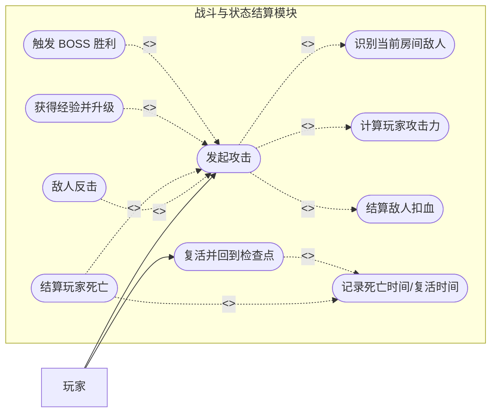
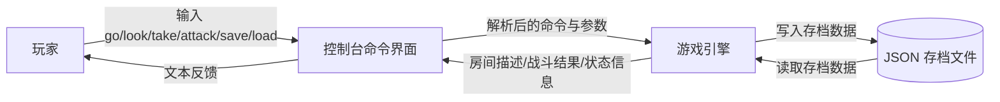
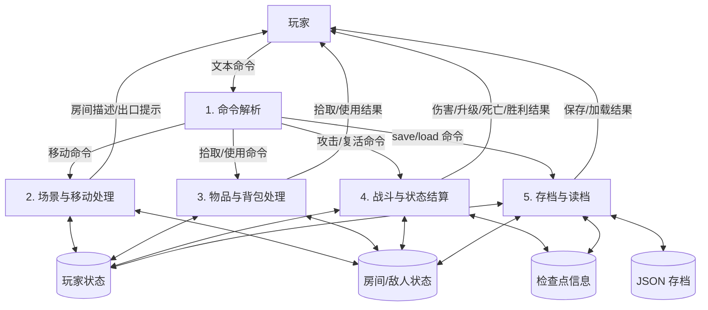

# Sprint 2 需求规格说明书（SRS）

> 文档定位：本说明书基于 4-3 阶段利用大语言模型生成并经团队复核的核心业务用例图与 DFD 数据流图整理而成，作为 Sprint 2 后续开发、测试与验收的统一需求依据。  
> 适用对象：`ai-and-us` 控制台 MUD 洞穴探险游戏。  
> 关联文档：`README.md`、`用户故事池.md`、`Sprint2_OOA建模与重构报告.md`

## 1. 引言

### 1.1 编写目的

本 SRS 用于明确 Sprint 2 阶段围绕“高耦合遗留代码重构”所对应的核心业务需求边界，规范表达系统的核心业务场景、关键数据流和功能协作关系，确保团队在重构过程中不偏离产品原始玩法与用户目标。

### 1.2 产品概述

本产品是一个基于控制台交互的单机文字冒险游戏。玩家通过文本命令在洞穴中移动、搜索房间、拾取物品、与敌人战斗、死亡后复活，并可通过保存和加载游戏延续进度。最终目标是击败 BOSS 房间中的远古巨龙。

### 1.3 文档范围

本次 Sprint 2 SRS 仅聚焦以下核心业务范围：

- 命令输入与解析
- 场景探索与房间移动
- 物品搜索、拾取、使用与背包管理
- 战斗与状态结算
- 检查点、死亡与复活
- 存档与读档

不包含以下范围：

- 图形界面
- 网络联机
- 数据库持久化
- 多角色并发操作

## 2. 产品业务范围与参与者

### 2.1 核心业务目标

- 玩家能够探索固定地图中的多个房间
- 玩家能够通过物品与等级成长增强战斗能力
- 玩家能够完成普通战斗与最终 BOSS 战斗
- 玩家在失败后能够通过检查点继续游戏
- 玩家能够保存当前进度并在后续恢复

### 2.2 参与者

| 参与者 | 类型 | 说明 |
|--------|------|------|
| 玩家 | 外部参与者 | 唯一业务参与者，通过控制台输入命令并接收系统反馈 |

## 3. 功能需求概览

### 3.1 功能模块

| 模块编号 | 模块名称 | 说明 |
|----------|----------|------|
| FR-01 | 命令解析 | 解析玩家输入并识别移动、观察、物品、战斗、系统命令 |
| FR-02 | 场景与移动 | 处理房间切换、出口提示、BOSS 方向提示 |
| FR-03 | 物品与背包 | 处理 `look`、`take`、`inventory`、`use` 等行为 |
| FR-04 | 战斗与状态结算 | 处理攻击、反击、经验、升级、死亡与胜利 |
| FR-05 | 检查点与复活 | 处理死亡记录、检查点恢复与复活结果 |
| FR-06 | 存档与读档 | 处理 JSON 文件存储和状态恢复 |

### 3.2 业务规则摘要

1. 玩家进入新房间后不会自动看到物品，必须先执行 `look`。
2. 玩家只有在当前房间存在存活敌人时才能执行有效攻击。
3. 敌人未被击败时会反击玩家。
4. 玩家 HP 为 0 时进入死亡状态，需执行 `respawn` 才能继续。
5. 玩家击败敌人后获得经验值，满足阈值时自动升级。
6. 玩家击败最终 BOSS 后游戏胜利。
7. 存档需保留玩家状态、房间状态与检查点元数据。

## 4. 核心业务用例图

### 4.1 图来源说明

以下用例图来自 4-3 阶段利用大语言模型生成、并在 `Sprint2_OOA建模与重构报告.md` 中经团队审阅确认的“战斗与状态结算模块”核心业务用例图。Sprint 2 需求分析沿用该成果，并按 SRS 规范补充参与者、用例关系及业务场景说明。

### 4.2 核心业务用例图

### 4.3 用例图元素说明

#### 4.3.1 参与者说明

- 玩家：
  - 通过 `attack` 发起战斗行为
  - 在死亡后通过 `respawn` 恢复到检查点

#### 4.3.2 用例说明

| 用例名称 | 类型 | 核心业务场景 |
|----------|------|--------------|
| 发起攻击 | 主用例 | 玩家在当前房间执行攻击命令，触发完整战斗流程 |
| 识别当前房间敌人 | `include` | 系统确认当前房间是否存在可战斗目标 |
| 计算玩家攻击力 | `include` | 系统根据基础攻击和武器加成计算伤害 |
| 结算敌人扣血 | `include` | 系统将玩家攻击力作用到敌人生命值 |
| 敌人反击 | `extend` | 敌人未死亡时，系统执行反击结算 |
| 结算玩家死亡 | `extend` | 玩家被敌人击败时，系统记录死亡并进入待复活状态 |
| 获得经验并升级 | `extend` | 玩家击败敌人并满足阈值时，系统提升等级和属性 |
| 触发 BOSS 胜利 | `extend` | 玩家击败最终 BOSS 时，系统宣告通关 |
| 复活并回到检查点 | 主用例 | 玩家死亡后执行复活命令，恢复到有效检查点 |
| 记录死亡时间/复活时间 | `include` | 系统记录生命周期关键时间点，支持状态追踪与恢复 |

### 4.4 用例关系说明

#### 4.4.1 `include` 关系

`发起攻击` 必须包含以下基础步骤：

- 识别当前房间敌人
- 计算玩家攻击力
- 结算敌人扣血

`复活并回到检查点` 必须包含：

- 记录复活时间

`结算玩家死亡` 必须包含：

- 记录死亡时间

#### 4.4.2 `extend` 关系

以下扩展行为仅在条件满足时触发：

- 敌人未死亡时，触发 `敌人反击`
- 玩家 HP 归零时，触发 `结算玩家死亡`
- 玩家经验值达到升级阈值时，触发 `获得经验并升级`
- 玩家击败 BOSS 时，触发 `触发 BOSS 胜利`

### 4.5 用例业务解读

该用例图体现了 Sprint 2 最核心的业务链路，即“攻击命令驱动的战斗状态变化”。其价值在于：

- 明确主流程与条件扩展流程的边界
- 为战斗模块重构提供稳定的业务骨架
- 保证后续代码解耦不会破坏既有玩法规则

## 5. 数据流图（DFD）

### 5.1 图来源说明

以下 DFD 同样来自 4-3 阶段大语言模型辅助生成并由团队复核后的成果，原始版本归档于 `Sprint2_OOA建模与重构报告.md`。本 SRS 在保留原图逻辑的基础上，补充了数据源、处理过程、数据存储、数据流及节点说明。

### 5.2 上下文级 DFD

### 5.3 上下文级 DFD 节点说明

| 节点编号 | 节点名称 | 类型 | 说明 |
|----------|----------|------|------|
| E1 | 玩家 | 数据源/外部实体 | 发起命令并接收反馈的唯一外部实体 |
| P0-1 | 控制台命令界面 | 处理过程 | 接收玩家输入并输出文本结果 |
| P0-2 | 游戏引擎 | 处理过程 | 执行核心业务逻辑，协调移动、物品、战斗、存档等过程 |
| D0-1 | JSON 存档文件 | 数据存储 | 保存和恢复游戏进度的持久化文件 |

### 5.4 上下文级数据流说明

| 数据流 | 来源 | 去向 | 说明 |
|--------|------|------|------|
| 输入命令 | 玩家 | 控制台命令界面 | 玩家输入 `go`、`look`、`attack` 等文本命令 |
| 解析后的命令与参数 | 控制台命令界面 | 游戏引擎 | 将原始文本转换为系统可执行的指令 |
| 房间描述/战斗结果/状态信息 | 游戏引擎 | 控制台命令界面 | 业务执行后的结果数据 |
| 文本反馈 | 控制台命令界面 | 玩家 | 最终展示给玩家的结果文本 |
| 写入存档数据 | 游戏引擎 | JSON 存档文件 | 将当前运行态写入存储 |
| 读取存档数据 | JSON 存档文件 | 游戏引擎 | 从外部文件恢复游戏进度 |

### 5.5 0 层 DFD

### 5.6 0 层 DFD 节点说明

#### 5.6.1 外部实体

| 节点编号 | 名称 | 说明 |
|----------|------|------|
| E1 | 玩家 | 通过文本命令驱动系统流程，并接收结果反馈 |

#### 5.6.2 数据处理过程

| 节点编号 | 过程名称 | 说明 |
|----------|----------|------|
| P1 | 命令解析 | 对玩家输入进行语法解析和命令分类 |
| P2 | 场景与移动处理 | 控制房间切换、出口检查和 BOSS 方向提示 |
| P3 | 物品与背包处理 | 管理搜索、拾取、使用物品与背包展示 |
| P4 | 战斗与状态结算 | 管理攻击、反击、经验、升级、死亡、胜利和复活 |
| P5 | 存档与读档 | 管理运行状态与 JSON 存档之间的写入和恢复 |

#### 5.6.3 数据存储

| 节点编号 | 存储名称 | 说明 |
|----------|----------|------|
| D1 | 玩家状态 | 包含生命值、等级、经验、背包、当前位置等信息 |
| D2 | 房间/敌人状态 | 包含房间出口、房间物品、敌人生命值和存活状态 |
| D3 | 检查点信息 | 包含检查点房间、死亡时间、复活时间等状态 |
| D4 | JSON 存档 | 用于持久化保存 D1、D2、D3 的外部文件载体 |

### 5.7 0 层数据流说明

| 数据流 | 来源 | 去向 | 说明 |
|--------|------|------|------|
| 文本命令 | 玩家 | P1 命令解析 | 原始控制台输入 |
| 移动命令 | P1 | P2 | 已识别的方向与移动指令 |
| 拾取/使用命令 | P1 | P3 | 已识别的物品交互命令 |
| 攻击/复活命令 | P1 | P4 | 已识别的战斗与生命周期命令 |
| save/load 命令 | P1 | P5 | 已识别的持久化命令 |
| 玩家状态读写 | P2/P3/P4/P5 | D1 | 读取或更新玩家属性与背包状态 |
| 房间/敌人状态读写 | P2/P3/P4/P5 | D2 | 读取或更新房间、物品与敌人状态 |
| 检查点信息读写 | P4/P5 | D3 | 读取或更新死亡、复活和检查点数据 |
| 存档数据写入/读取 | P5 | D4 | 将游戏状态持久化或从文件恢复 |
| 房间描述/出口提示 | P2 | 玩家 | 场景切换后的文字结果 |
| 拾取/使用结果 | P3 | 玩家 | 物品交互后的反馈 |
| 伤害/升级/死亡/胜利结果 | P4 | 玩家 | 战斗与生命周期结果反馈 |
| 保存/加载结果 | P5 | 玩家 | 存档与读档结果反馈 |

### 5.8 DFD 业务解读

该 DFD 体现出当前系统的业务数据流是一个单机闭环：

- 玩家是唯一外部数据源
- 游戏引擎是当前核心业务处理中心
- 玩家状态、房间状态、检查点信息是核心运行态数据
- JSON 存档是唯一外部持久化存储

从需求角度看，这一结构说明 Sprint 2 的重构必须保证以下三点：

1. 不破坏既有的数据流方向和用户交互路径
2. 不遗漏玩家状态、房间状态、检查点状态的完整保存与恢复
3. 在代码解耦后仍保持命令解析、战斗结算和持久化流程的一致性

## 6. 核心功能需求说明

### 6.1 FR-01 命令解析

- 系统应支持识别移动、观察、物品、战斗、复活、存档、加载、退出等命令
- 系统应支持常见输入容错，如 `take<铁剑>`、`take铁剑`、`use<生命药水>`
- 系统应对未知命令返回明确提示

### 6.2 FR-02 场景与移动

- 系统应支持玩家在合法出口方向上移动
- 系统应在移动失败时提示当前可用出口
- 系统应在适当场景下提示前往 BOSS 的方向

### 6.3 FR-03 物品与背包

- 系统应要求玩家先执行 `look` 后才能发现房间内物品
- 系统应支持拾取房间中的合法物品
- 系统应支持展示背包内容及物品效果说明
- 系统应支持使用可使用物品并更新玩家状态

### 6.4 FR-04 战斗与状态结算

- 系统应支持玩家对当前房间中的存活敌人发起攻击
- 系统应在敌人存活时执行反击
- 系统应在敌人死亡后结算经验值
- 系统应在经验值满足条件时执行升级
- 系统应在击败最终 BOSS 时返回胜利结果

### 6.5 FR-05 检查点与复活

- 系统应在合法时机记录检查点
- 系统应在玩家死亡时记录死亡时间并进入待复活状态
- 系统应在玩家执行 `respawn` 后恢复到有效检查点
- 系统应保留与复活相关的时间信息，用于状态追踪

### 6.6 FR-06 存档与读档

- 系统应支持将当前游戏状态保存为 JSON 文件
- 系统应支持从 JSON 文件恢复当前游戏状态
- 系统应确保玩家状态、房间状态和检查点信息在读档后保持一致
- 系统应在文件不存在或结构非法时返回明确错误提示

## 7. 非功能需求

### 7.1 一致性

- 重构后的实现必须保持核心业务流程与本 SRS 中的用例图、DFD 一致
- 任何架构层面的调整不得改变玩家可见的核心玩法规则

### 7.2 可测试性

- 核心业务流程应支持单元测试验证，包括攻击、复活、存档、读档等主流程
- 关键分支应能通过测试覆盖到输入校验、状态变化和输出结果

### 7.3 可维护性

- 需求文档中的处理过程和用例边界应可映射到代码中的模块边界
- 后续 Sprint 若调整业务流程，应同步更新本 SRS 中对应图示与说明

## 8. 验收要点

### 8.1 用例一致性验收

- 系统实现应支持 `发起攻击` 与 `复活并回到检查点` 两个主用例
- `include` 与 `extend` 关系对应的业务触发条件应与文档一致

### 8.2 数据流一致性验收

- 命令解析、移动、物品、战斗、存档各处理过程应与 DFD 对应
- 玩家状态、房间状态、检查点信息三类核心数据不得遗漏
- 保存与加载过程应能双向覆盖 D1、D2、D3 到 D4 的映射关系

---

**SRS 更新结论**  
本次更新已将 4-3 阶段大语言模型生成并经团队确认的核心用例图与 DFD 数据流图整理到需求规格说明书中，并补齐了节点说明、关系说明和功能需求说明，可作为 Sprint 2 后续开发、重构与测试验收的核心依据。
