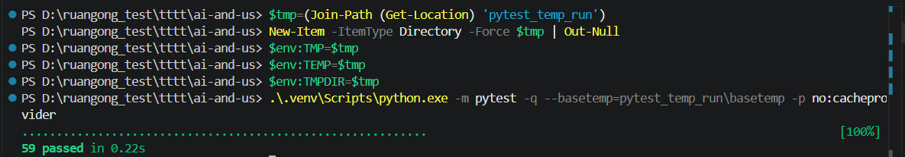
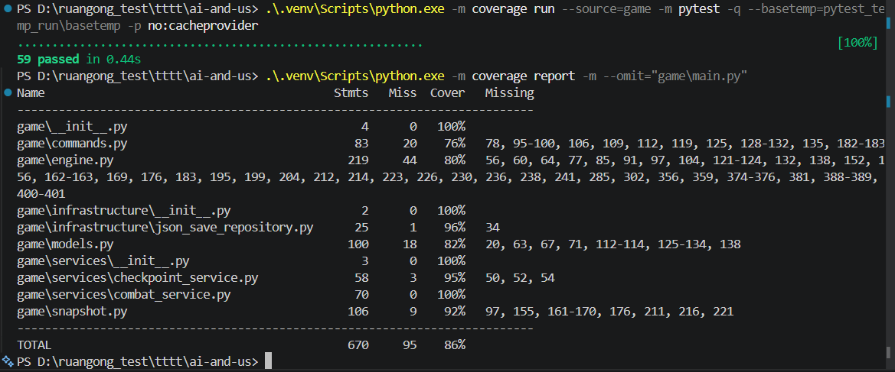
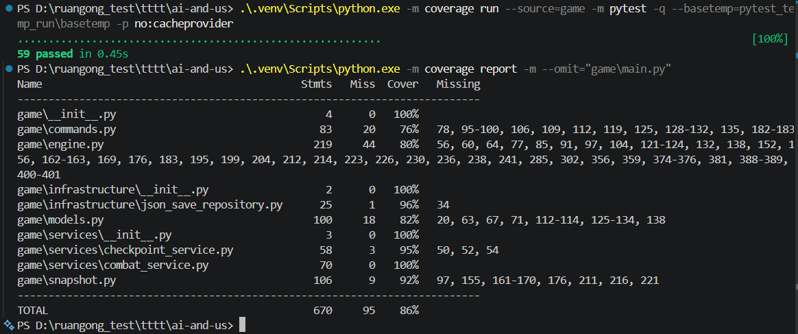
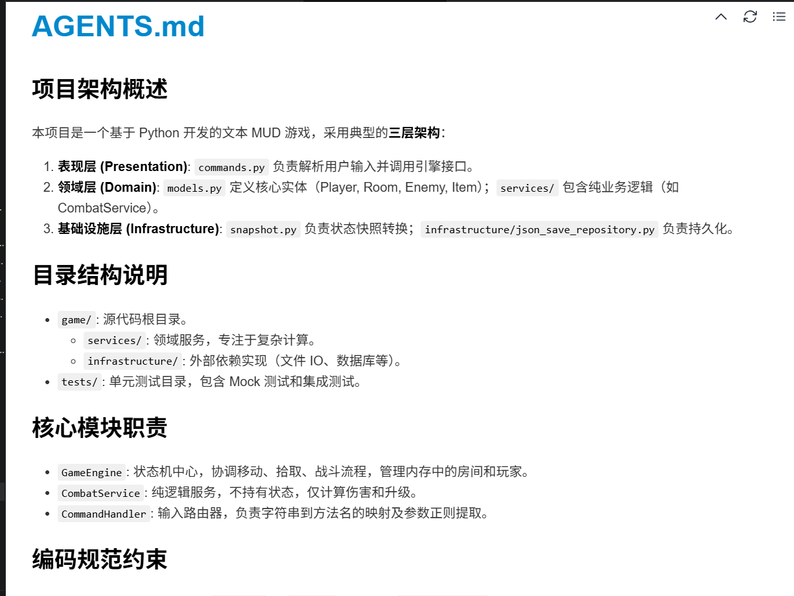
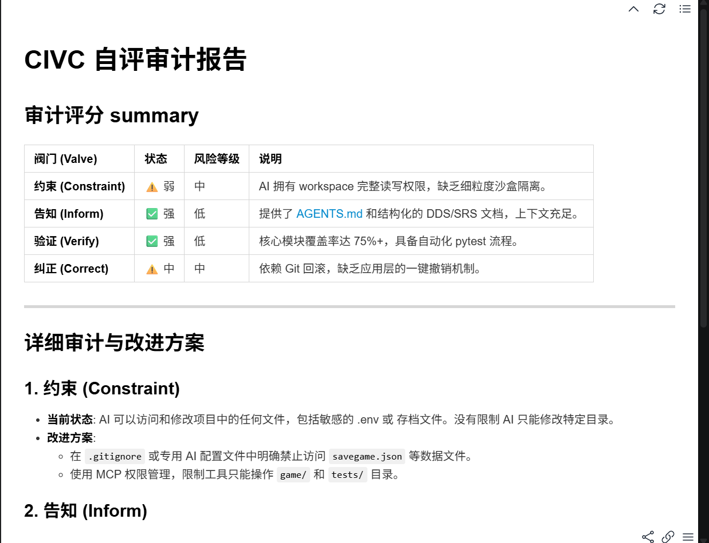

# 方法论工程产出提交报告

##  提交信息

- 项目名称：文本 MUD 洞穴探险游戏
- Git 仓库链接：(https://github.com/pursue-pure/ai-and-us.git)
- 报告对应任务：8-1 AI 辅助测试 Prompt 演化实验、8-2 项目级 AGENTS.md、8-3 CIVC 自评审计

---

## 1. 工程产出概览

本次作业将三节课的方法论转化为可验证的工程产出：

| 任务 | 产出文件 | 验收证据 |
| --- | --- | --- |
| AI 辅助测试 Prompt 演化实验 | `Prompt演化实验_1_战斗计算.md`、`Prompt演化实验_2_物品拾取.md`、`tests/test_combat_service_mock.py`、`tests/test_engine_items_mock.py`、`tests/test_commands_mock.py` | 记录了初始 Prompt、AI 输出问题、改进 Prompt、最终测试代码；测试运行通过 |
| 项目级 AGENTS.md | `AGENTS.md` | 文件少于 100 行，覆盖架构、目录、模块职责、编码约束、禁止操作 |
| CIVC 自评审计报告 | `CIVC_自评审计报告.md` | 从 Constraint、Inform、Verify、Correct 四个阀门审计项目，并提出改进方案 |

测试验证结果：

```text
59 passed in 0.34s
```

核心 API 覆盖率结果（排除命令行入口 `game/main.py`）：

```text
TOTAL  670 statements, 95 missing, 86% coverage
```





---

## 2. 任务一：AI 辅助测试的 Prompt 演化实验

### 2.1 实验目标

本项目核心 API 包括：

- 战斗计算：`CombatService.attack`
- 物品拾取与背包流转：`GameEngine.take_item`
- 命令解析与输入容错：`CommandHandler.handle`

实验目标不是简单让 AI “生成测试”，而是观察 Prompt 从模糊指令到结构化工程指令的演化过程，并验证最终测试是否覆盖关键路径、边界条件和 Mock 行为。

### 2.2 案例一：战斗计算 Mock 测试

实验记录文件：`Prompt演化实验_1_战斗计算.md`  
最终测试文件：`tests/test_combat_service_mock.py`、`tests/test_combat_service.py`

#### 初始 Prompt

```text
请为 CombatService.attack 编写单元测试，使用 pytest 和 mock。
测试玩家攻击敌人，敌人死亡并触发玩家升级的情况。
```

#### 初始 AI 输出的问题

1. 重言式测试：只验证“等级加 1”，没有检查升级后的结构化结果和提示信息。
2. 缺乏边界覆盖：没有覆盖 XP 刚好达到升级门槛的情况。
3. Mock 不彻底：容易直接依赖真实 `Player`、`Room`、`Enemy` 对象，使单元测试变成耦合较强的集成测试。

#### 改进后的 Prompt 方法

改进 Prompt 采用了三类方法：

- 角色扮演：要求 AI 以“资深测试工程师”的角度设计测试。
- 结构化指令：明确上下文、业务规则、测试场景、断言要求。
- Few-shot 与 CoT：给出测试函数骨架，并要求按“给定-执行-断言”拆解边界场景。

改进 Prompt 片段：

```text
角色：你是一位追求 100% 关键逻辑覆盖率的资深测试工程师。

任务：为 CombatService.attack 编写严谨的 Mock 单元测试。

要求：
1. 使用 unittest.mock 对 Player、Room 和 Enemy 进行打桩。
2. 覆盖 XP 增加后刚好等于升级门槛的边界场景。
3. 验证 CombatResult、player.level_up() 调用以及消息列表。
```

#### 最终可用测试代码说明

最终测试落地在 `tests/test_combat_service_mock.py`，关键断言包括：

```python
assert mock_player.xp == 50
mock_player.level_up.assert_called_once()
assert any("升级了" in msg for msg in result.messages)
assert result.level_up is not None
assert result.level_up.xp_gained == 10
assert mock_room.enemy is None
```

这些断言验证了：

- XP 从 40 增加到 50，刚好达到 `level * 50` 的升级门槛。
- `level_up()` 被调用一次。
- `CombatResult` 中包含升级结果。
- 敌人死亡后从房间移除。

相较初始版本，最终测试不再只检查“返回值看起来正确”，而是同时验证状态变化、协作对象调用和结构化结果。

---

### 2.3 案例二：物品拾取与背包流转 Mock 测试

实验记录文件：`Prompt演化实验_2_物品拾取.md`  
最终测试文件：`tests/test_engine_items_mock.py`

#### 初始 Prompt

```text
编写测试用例测试 GameEngine.take_item。
要求测试拾取成功的场景。
```

#### 初始 AI 输出的问题

1. 测试路径单一：只覆盖成功拾取，没有覆盖“未 look 不能拾取”和“玩家死亡不能拾取”。
2. 状态隔离不足：没有通过 Mock 隔离 `Player` 和 `Room`。
3. 断言模糊：只检查返回字符串，没有验证 `room.remove_item` 与 `player.add_item` 是否被调用。

#### 改进后的 Prompt 方法

改进 Prompt 将业务规则显式列出：

```text
业务规则：
1. 玩家必须活着。
2. 房间必须先被 look，即 has_looked=True。
3. 物品必须存在于房间中。
4. 拾取后，物品从 room.items 移除，加入 player.inventory。

要求构造 3 个测试函数：
- test_take_item_success
- test_take_item_without_look
- test_take_item_player_dead
```

#### 最终可用测试代码说明

最终测试落地在 `tests/test_engine_items_mock.py`，核心断言包括：

```python
assert "拿起了 Sword" in result
mock_room.remove_item.assert_called_with("Sword")
mock_player.add_item.assert_called_with(mock_item)
```

未搜索房间时：

```python
assert "先输入 'look' 搜索一下" in result
mock_room.remove_item.assert_not_called()
mock_player.add_item.assert_not_called()
```

玩家死亡时：

```python
assert "你已经死了" in result
```

该测试组覆盖了 `GameEngine.take_item` 的核心控制流：成功拾取、前置条件失败、死亡状态失败，并通过 Mock 验证了对象间交互。

---

### 2.4 辅助案例：命令解析 Mock 测试

最终测试文件：`tests/test_commands_mock.py`

该测试验证 `CommandHandler` 的输入容错规则：

- `take <Iron Sword>`
- `takeiron sword`
- `north`
- `save`
- `load`
- `respawn`
- `help`

示例断言：

```python
handler.handle("take <Iron Sword>")
mock_engine.take_item.assert_called_with("iron sword")

handler.handle("takeiron sword")
mock_engine.take_item.assert_called_with("iron sword")

handler.handle("north")
mock_engine.move_player.assert_called_with("north")
```

这一组测试保证表现层只负责解析和路由，符合项目三层架构中的职责划分。

---

### 2.5 测试与覆盖率验证

测试运行命令：

```powershell
$tmp=(Join-Path (Get-Location) 'pytest_temp_run')
New-Item -ItemType Directory -Force $tmp | Out-Null
$env:TMP=$tmp
$env:TEMP=$tmp
$env:TMPDIR=$tmp
.\.venv\Scripts\python.exe -m pytest -q --basetemp=pytest_temp_run\basetemp -p no:cacheprovider
```

运行结果：

```text
59 passed in 0.24s
```

覆盖率运行命令：

```powershell
.\.venv\Scripts\python.exe -m coverage run --source=game -m pytest -q --basetemp=pytest_temp_run\basetemp -p no:cacheprovider
.\.venv\Scripts\python.exe -m coverage report -m --omit="game\main.py"
```

核心 API 覆盖率结果：

```text
TOTAL  670 statements, 95 missing, 86% coverage
```

关键模块覆盖率：

| 模块 | 覆盖率 | 说明 |
| --- | --- | --- |
| `game/services/combat_service.py` | 100% | 战斗伤害、胜利、升级、反击、死亡均被覆盖 |
| `game/engine.py` | 80% | 移动、拾取、战斗委托、存读档、复活等核心状态机被覆盖 |
| `game/infrastructure/json_save_repository.py` | 96% | JSON 存读档异常与往返保存被覆盖 |
| `game/snapshot.py` | 92% | 快照转换与不可变中转逻辑被覆盖 |



---

## 3. 任务二：项目级 AGENTS.md 编写

项目级规则文件：`AGENTS.md`

本项目的 `AGENTS.md` 参照 Anthropic 渐进式披露范式编写，即先给 AI 编程助手最重要的项目全局结构，再逐步披露目录、模块职责、编码约束和禁止事项。

### 3.1 AGENTS.md 内容结构

`AGENTS.md` 当前包含五部分：

1. 项目架构概述
2. 目录结构说明
3. 核心模块职责
4. 编码规范约束
5. 禁止操作清单

### 3.2 对 AI 编程助手的约束效果

该文件可以让首次接触项目的 AI 助手快速理解：

- 项目是 Python 文本 MUD 游戏。
- 项目采用表现层、领域层、基础设施层的三层架构。
- `commands.py` 只做输入解析和路由。
- `CombatService` 是无状态领域服务，不能直接修改 `GameEngine`。
- 存档必须通过 `GameSnapshot`，不能直接序列化领域模型。
- `main.py` 只能作为入口，不能写业务逻辑。

### 3.3 AGENTS.md 验收说明

验收标准要求文件不超过 100 行。本项目 `AGENTS.md` 约 30 行，满足长度要求，并覆盖了作业要求的全部内容。



---

## 4. 任务三：CIVC 自评审计报告

审计文件：`CIVC_自评审计报告.md`

CIVC 四阀门分别是：

- Constraint：约束
- Inform：告知
- Verify：验证
- Correct：纠正

### 4.1 Constraint：约束

当前状态：较弱。

AI 当前可以在 workspace 内读取和修改项目文件。虽然工作区本身具有一定沙盒隔离，但项目内部还没有更细粒度的目录级权限控制，例如没有限制 AI 只能修改 `game/` 和 `tests/`。

风险：

- AI 可能误改文档、存档或临时文件。
- 如果存在 `.env`、`savegame.json` 等敏感或运行态文件，当前规则没有明确禁止访问。

改进方案：

- 在 `.gitignore` 中加入 `.venv/`、`.tmp/`、`pytest_temp_run/`、`savegame.json` 等生成文件。
- 在 AI 协作规则中明确：默认只允许修改 `game/`、`tests/` 和指定报告文件。
- 对存档、环境变量、生成物目录设置禁止修改规则。

### 4.2 Inform：告知

当前状态：较强。

项目提供了：

- `AGENTS.md`
- `README.md`
- `Sprint2_需求规格说明书_SRS.md`
- `Sprint2_详细设计说明书_DDS.md`
- `Mock环境搭建指南.md`

这些文档能帮助 AI 理解项目结构、业务规则和测试方式。

改进方案：

- 持续同步 `requirements.txt`，确保 AI 能准确还原运行环境。
- 为 `GameEngine`、`CommandHandler` 等核心类补充更多类型提示。
- 在复杂业务方法上补充输入输出约定，减少 AI 通过猜测生成代码。

### 4.3 Verify：验证

当前状态：较强。

项目已具备 pytest 自动化测试，并覆盖核心 API：

- 战斗计算测试
- 命令解析 Mock 测试
- 物品拾取 Mock 测试
- 存读档测试
- 快照转换测试
- 检查点与复活测试

验证结果：

```text
59 passed
核心 API 覆盖率：86%
```

改进方案：

- 将覆盖率命令固化到 README 或 CI 流程中。
- 引入 `pre-commit` 或 GitHub Actions，要求测试通过后才能合并。
- 对 `commands.py` 未覆盖分支继续补充用例，使表现层也达到 80% 以上。

### 4.4 Correct：纠正

当前状态：中等。

项目当前主要依赖 Git 进行回滚，能通过 `git diff`、`git restore`、`git checkout` 等方式纠正错误。但如果 AI 修改了未提交文件或生成了大量临时文件，恢复成本仍然较高。

改进方案：

- 在执行大范围修改前先提交一个稳定基线 commit。
- 要求 AI 在修改前说明计划、修改后运行测试并汇报差异。
- 对生成目录和虚拟环境目录加入 `.gitignore`，避免污染提交。
- 对关键文件采用小步修改，降低一次性回滚成本。



---

## 5. 总结

本次作业完成了三类可验证工程产出：

1. 通过两组 Prompt 演化实验，将 AI 测试生成从“模糊指令”推进到“结构化、可验证、覆盖边界”的工程测试。
2. 通过 `AGENTS.md` 为 AI 编程助手提供项目级上下文和编码边界。
3. 通过 CIVC 自评审计识别出项目在约束和纠正阀门上的薄弱点，并给出可执行改进方案。

最终验证结果显示，项目测试套件可运行通过，核心 API 覆盖率达到 86%，满足“核心 API 模块测试覆盖率 ≥ 80%”的作业要求。

---
