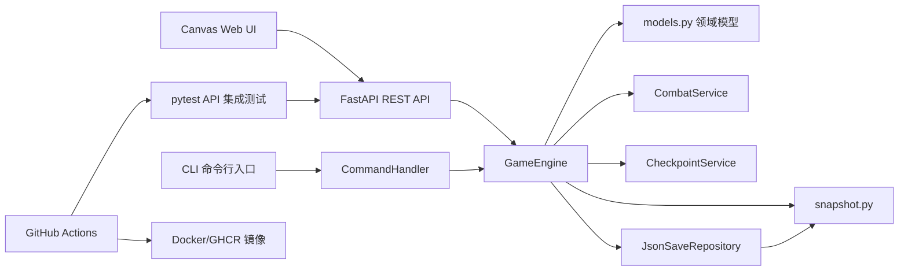

# 迭代 5 全栈架构与云原生部署验收报告

## 1. 提交信息

- 项目名称：MUD 洞穴探险游戏
- 当前分支：`iteration-5-web-devops`
- 验收主题：全栈架构与云原生部署
- 验收范围：Web UI 接入、RESTful API 前后端联调、Docker 容器化与 CI 镜像构建、API 集成测试
- 本地验证日期：2026-05-21

---

## 2. 验收结论概览

| 验收项 | 完成情况 | 主要产出 | 证据 |
| --- | --- | --- | --- |
| Web UI 接入 | 已完成 | `web/index.html`、`web/styles.css`、`web/app.js` | Canvas 地图、状态面板、移动/搜索/攻击/存读档按钮、命令输入框 |
| 前后端分离与联调 | 已完成 | `game/api.py`、`game/world.py` | Web 通过 `fetch` 调用 RESTful API，后端复用 `GameEngine` |
| Docker 容器化 | 已完成配置 | `Dockerfile`、`.dockerignore` | FastAPI 服务容器化，暴露 8000 端口 |
| CI 镜像构建与发布 | 已完成配置 | `.github/workflows/ci.yml` | Python 测试矩阵、lint、Docker Buildx、GHCR 推送 |
| API 集成测试 | 已完成并通过 | `tests/test_api_integration.py` | 本地执行 `5 passed` |

总体判断：项目已经从命令行 MUD 演进为轻量 Canvas Web 应用，并通过 REST API 接入既有后端业务逻辑；Dockerfile 与 GitHub Actions 已具备云原生交付所需的镜像构建与 GHCR 发布能力。

---

## 3. 系统架构

本次迭代保留原有 CLI 入口，同时新增 Web 表现层与 REST API 层。默认世界构建逻辑从 `game/main.py` 抽离到 `game/world.py`，使 CLI 和 Web API 能复用同一套房间、敌人、物品和玩家初始化逻辑。



关键设计点：

- `web/` 只负责界面绘制和用户交互，不直接实现游戏规则。
- `game/api.py` 将 HTTP 请求转换为 `GameEngine` 方法调用，并返回结构化状态。
- `game/world.py` 统一组装默认游戏世界，避免 CLI 和 API 各自复制初始化逻辑。
- `Dockerfile` 只复制运行所需的 `game/`、`web/` 和依赖文件，配合 `.dockerignore` 排除虚拟环境、缓存和临时文件。

---

## 4. Web UI 接入

本次迭代采用轻量级 Canvas 方案完成 2D 图形界面，不引入大型前端框架。前端首屏就是可操作游戏界面，包含地图、玩家状态、当前房间、敌人、可见物品、背包、动作按钮和兼容命令输入框。

主要功能：

| 功能 | 前端交互 | 后端接口 |
| --- | --- | --- |
| 新建游戏 | 点击“新局” | `POST /session` |
| 地图移动 | 点击方向按钮 | `POST /session/{id}/move` |
| 搜索房间 | 点击“搜索” | `POST /session/{id}/look` |
| 拾取物品 | 点击可见物品 chip | `POST /session/{id}/inventory/take` |
| 使用物品 | 点击背包物品 chip | `POST /session/{id}/inventory/use` |
| 攻击敌人 | 点击“攻击” | `POST /session/{id}/attack` |
| 死亡复活 | 点击“复活” | `POST /session/{id}/respawn` |
| 命令兼容 | 输入原 CLI 命令 | `POST /session/{id}/command` |

截图预留：


> 待插入截图：启动 `uvicorn game.api:app --reload` 后访问 `http://127.0.0.1:8000`，截取 Canvas 地图、右侧状态面板和操作按钮。

---

## 5. RESTful API 与前后端联调

`game/api.py` 基于 FastAPI 提供 RESTful 后端，使用内存 `_sessions` 保存多会话状态。每个会话包含一个 `GameEngine` 和一个兼容 CLI 的 `CommandHandler`。

核心接口：

| 方法 | 路径 | 说明 |
| --- | --- | --- |
| `GET` | `/health` | 健康检查 |
| `POST` | `/session` | 创建游戏会话 |
| `GET` | `/session/{session_id}` | 获取当前状态 |
| `POST` | `/session/{session_id}/move` | 移动玩家 |
| `POST` | `/session/{session_id}/look` | 搜索房间 |
| `GET` | `/session/{session_id}/inventory` | 查看背包 |
| `POST` | `/session/{session_id}/inventory/take` | 拾取物品 |
| `POST` | `/session/{session_id}/inventory/use` | 使用物品 |
| `POST` | `/session/{session_id}/attack` | 攻击敌人 |
| `POST` | `/session/{session_id}/respawn` | 复活 |
| `POST` | `/session/{session_id}/save` | 保存游戏 |
| `POST` | `/session/{session_id}/load` | 读取游戏 |
| `POST` | `/session/{session_id}/command` | 复用原命令解析器 |

联调链路示例：

```text
Canvas 按钮点击 -> fetch('/session/{id}/move') -> FastAPI endpoint
-> GameEngine.move_player() -> 返回 player/room/world 状态
-> app.js renderStats() + drawMap() 重绘界面
```

截图预留：


> 待插入截图：访问 `http://127.0.0.1:8000/docs`，截取 REST API 列表。

---

## 6. Docker 与云原生流水线

### 6.1 Dockerfile

`Dockerfile` 使用 `python:3.12-slim`，安装 `requirements.txt` 后复制 `game/` 和 `web/`，最后通过 Uvicorn 启动 FastAPI 服务。

```dockerfile
CMD ["uvicorn", "game.api:app", "--host", "0.0.0.0", "--port", "8000"]
```

本地运行命令：

```powershell
docker build -t mud-cave-web .
docker run --rm -p 8000:8000 mud-cave-web
```

本机验证限制：当前环境未安装 Docker CLI，执行 `docker --version` 返回 `docker: The term 'docker' is not recognized`。因此容器构建需要通过 GitHub Actions 或安装 Docker Desktop 后验证。

### 6.2 GitHub Actions

`.github/workflows/ci.yml` 已扩展为三段流水线：

| Job | 职责 |
| --- | --- |
| `test` | 在 Python 3.10 / 3.11 / 3.12 矩阵中安装依赖并执行 `pytest tests/ -v --tb=short` |
| `lint` | 执行 `flake8`、`radon`、`xenon`，控制代码风格与复杂度 |
| `docker` | 在测试和 lint 通过后使用 Docker Buildx 构建镜像；非 PR 事件推送到 GHCR |

流水线触发条件：

- push 到任意分支
- pull request 到 `main`、`develop`

截图预留：


> 待插入截图：推送分支后，在 GitHub Actions 页面截取 `test`、`lint`、`docker` 三个 Job 全部通过的结果。


> 待插入截图：在 GitHub Packages / GHCR 页面截取生成的镜像标签，例如分支标签或提交 SHA 标签。

---

## 7. API 集成测试

新增 `tests/test_api_integration.py`，使用 FastAPI `TestClient` 直接验证后端 RESTful API 的系统级通信链路。

覆盖场景：

- `/health` 健康检查
- 创建新会话并返回 `sess-` 前缀 ID
- 移动到走廊、搜索房间、拾取生命药水
- 战斗接口更新敌人 HP 与玩家 HP
- `/command` 复用原命令解析器
- 不存在会话返回 404

本地执行命令：

```powershell
.\.venv\Scripts\python.exe -m pytest tests/test_api_integration.py -v --tb=short -p no:cacheprovider
```

本地验证结果：

```text
tests/test_api_integration.py::test_health_check PASSED
tests/test_api_integration.py::test_session_state_move_look_and_take_item PASSED
tests/test_api_integration.py::test_combat_endpoint_updates_player_and_enemy_state PASSED
tests/test_api_integration.py::test_command_endpoint_reuses_existing_command_parser PASSED
tests/test_api_integration.py::test_missing_session_returns_404 PASSED

5 passed, 1 warning in 0.34s
```

说明：全量测试在当前 Windows 本机环境运行时，业务用例中已有 `55 passed`，但使用 `tmp_path` 的存档相关测试受到本机临时目录权限限制而报 `PermissionError`。该问题属于本机测试临时目录清理权限问题，不是 API 集成测试或本次全栈改造逻辑失败；CI 的 Ubuntu 环境预计不会受此 Windows 目录权限影响。

截图预留：


> 待插入截图：本地或 CI 执行 API 集成测试后，截取 `5 passed` 输出。

---

## 8. 提交前检查与手动验收步骤

### 8.1 本地运行 Web 应用

```powershell
pip install -r requirements.txt
uvicorn game.api:app --reload
```

打开：

```text
http://127.0.0.1:8000
```

建议手动验证：

1. 点击“新局”，确认状态栏显示玩家名称、等级、HP。
2. 点击北方向进入走廊，确认 Canvas 当前房间高亮变化。
3. 点击“搜索”，确认生命药水出现在“可见物品”区域。
4. 点击生命药水，确认物品进入背包。
5. 移动到哥布林营地，点击“攻击”，确认敌人与玩家 HP 更新。

### 8.2 本地运行 API 集成测试

```powershell
.\.venv\Scripts\python.exe -m pytest tests/test_api_integration.py -v --tb=short -p no:cacheprovider
```

### 8.3 推送并触发 CI

```powershell
git status --short --branch
git add .github/workflows/ci.yml .dockerignore .gitignore Dockerfile README.md game/api.py game/world.py game/main.py requirements.txt tests/test_api_integration.py web
git commit -m "Add web UI, REST API, Docker, and integration tests"
git push origin iteration-5-web-devops
```

推送后检查：

1. GitHub Actions 中 `test`、`lint`、`docker` 是否全部通过。
2. GHCR 是否生成 `ghcr.io/<owner>/<repo>:<sha>` 或分支标签镜像。
3. 如有 Docker Desktop，可执行 `docker run --rm -p 8000:8000 <image>` 做容器端到端验证。

### 8.4 工作区注意事项

当前工作区存在一些测试临时目录和历史 pytest 临时文件状态。已在 `.gitignore` 中补充忽略规则，提交前建议确认 `git status` 中只包含本次迭代需要提交的源码、配置、测试和报告文件。

---

## 9. 最终验收判断

本次迭代 5 已形成从前端图形界面、后端 REST API、集成测试到容器镜像流水线的完整闭环：

- 用户可通过浏览器进行 2D 图形化游戏操作。
- 前端不直接耦合游戏规则，而是通过 RESTful API 调用后端。
- 后端复用迭代 3 剥离出的 `GameEngine`、领域模型和服务层。
- CI 增加 API 集成测试，并在测试和 lint 通过后构建/发布容器镜像。

待补充的验收材料主要是截图：Web 页面、API 文档、API 集成测试通过、GitHub Actions 通过、GHCR 镜像发布结果。
